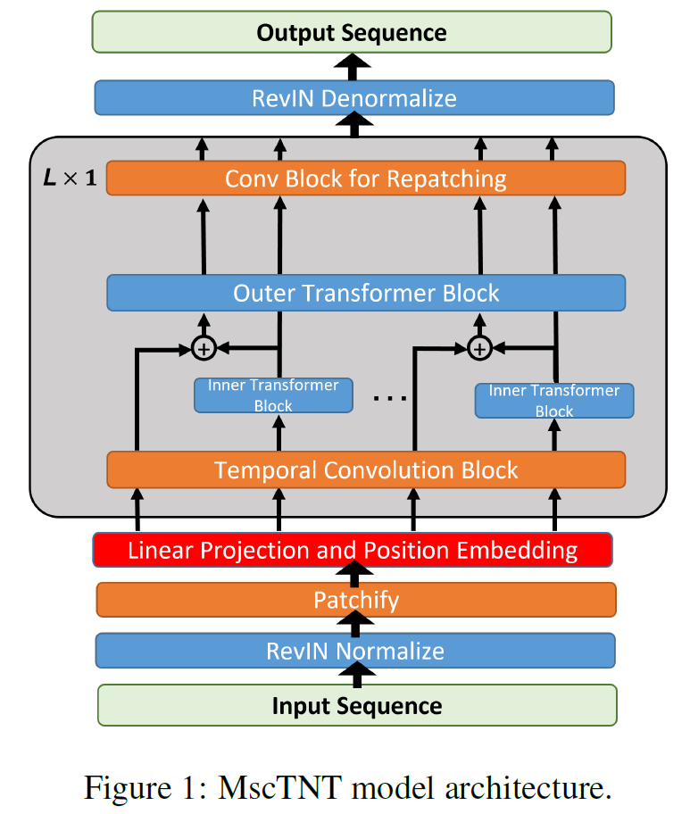
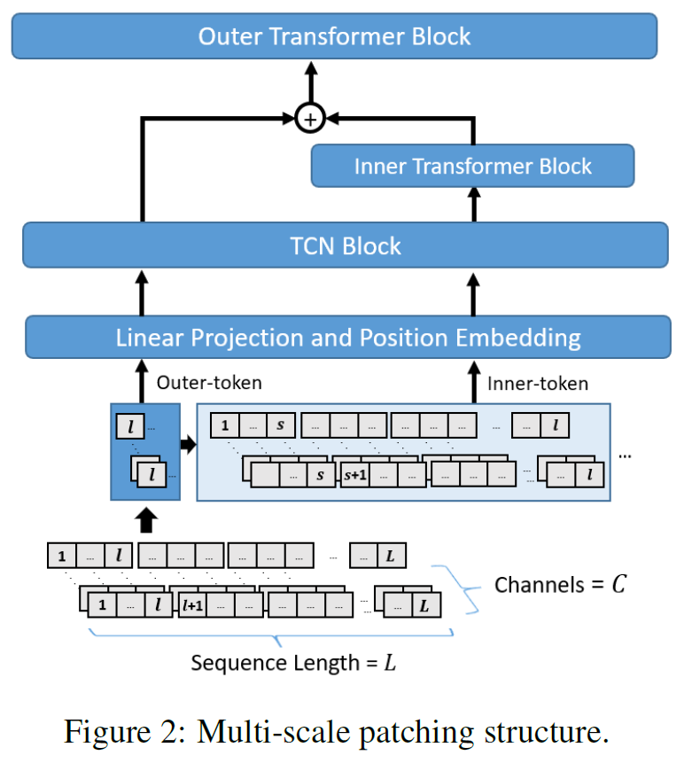
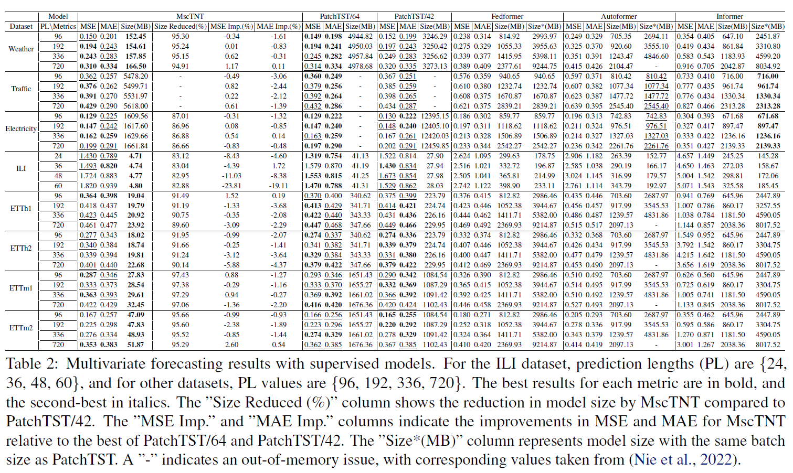
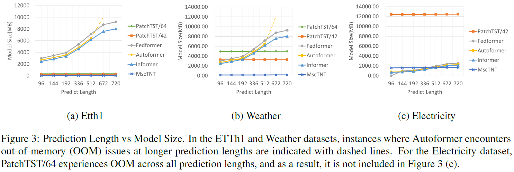
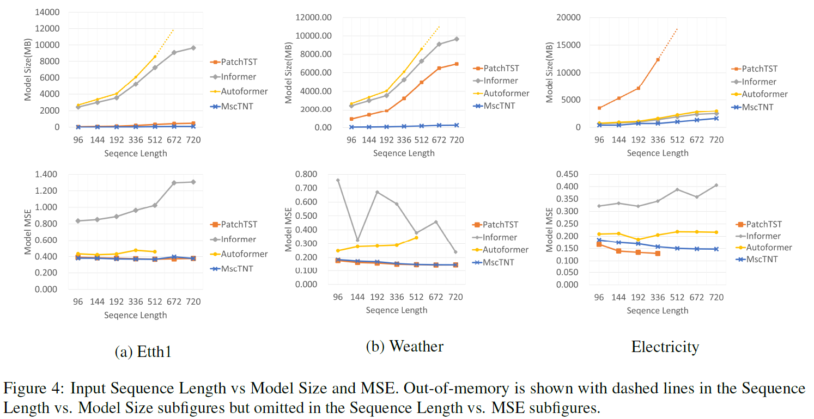
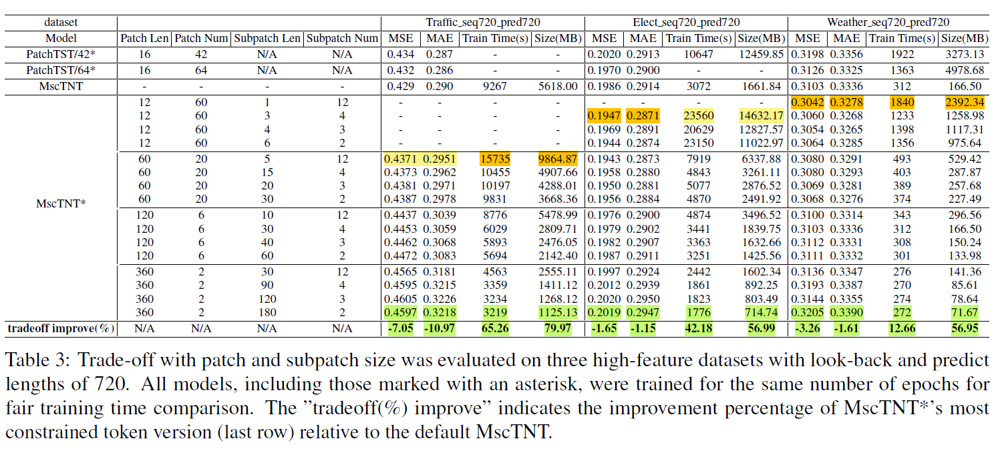

# MscTNT: Multi-Scale Transformer Model for Long Sequence Time Series Forecasting
**This repository provides the official PyTorch implementation of **[MscTNT](https://tdr.lib.ntu.edu.tw/jspui/handle/123456789/96370)**. The model is designed for supervised learning tasks on both multivariate and univariate time series data.**  

## Key Design
:sparkles: **Multi-Scale Patchify:**  
Divides(patchifies) the long input sequence into two granularities, ie. coarse and fine granularity, and learns the representations of the time series within distinct time scales. 


<div align=center>
 
</div>

## key Features

* **Significantly reduces the number of input tokens** :  
    * Reduces the number of input tokens processed by the Outer-Transformer with large patch size, thereby effectively reducing the overall model size. 
    * With fewer tokens, the attention map will become more interpretable.

* **Reduced expenditure, equivalent outcome** :    
    * Inner-Transformer, which learns the temporal embedding inside distinct patches with a shared parameters set, makes up for the lack of details with negligible additional cost. 
    * With a moderate hyperparameter setting, **reduce 91.41% size** with only sacrificing about 2% increasing error compared to PatchTST. 

* **Longer, complex sequences processing oriented** : 
    * More moderate model size growth rate while increasing the lookback or predict horizon. 
    * Alleviate symptoms of extreme large model size while forecasting numerous(hundreds) features, which PatchTST suffers from.

* **Model with flexibility** :
    * The dual-level structure ensures flexibility, enabling a balanced trade-off between predictive accuracy and the computational cost. 
    * By adjusting hyperparameters, the model can be tailored to achieve state-of-theart predictive performance, a compact version with competitive accuracy, or a variant that strikes a balance between the two. 
    * Leveraging the model’s flexibility, it may be possible to employ Knowledge Distillation techniques, such as the Teacher-Student Architecture, to develop more compact models that are well-suited for deployment on resource-constrained devices like sensors and other small-scale platforms.

## Results
### 1. Supervised Learning

* **1.1 Comparison with classic models :**
    * MscTNT achieves a 91.41% reduction in model size on average while incurring only a 1.89% increase in MSE and a 2.27% increase in MAE compared to PatchTST.

    * MscTNT outerpreforms other base lines, such as Fedformer.

    * For high-dimensional datasets such as Electricity and Traffic, which contain hundreds of features, MscTNT maintains accuracy comparable to PatchTST while overcoming out-of-memory (OOM) issues on GPUs with 24 GB of RAM, an issue PatchTST faces under similar conditions.

<div align=center>

</div>

<br/>

* **1.2 Upddate 1 : Comparison with newer SOTA model DeformableTST**  
    The table below illustrates this comparison(Imp.(%) represents the percentage improvement of MscTNT compared to DeformableTST) :  

    |          | DeformableTST MSE | MscTNT_L MSE | MSE Imp.(%) | DeformableTST MAE | MscTNT_L MAE | MAE Imp.(%) |
    |----------|-----------------|--------|----------|-----------------|--------|----------|
    | MSE      | 0.310           | 0.304  | 1.94     | 0.331           | 0.328  | 0.91    |
    | ECL      | 0.197           | 0.195  | 1.02     | 0.296           | 0.287  | 3.04    |
    | Traffic  | 0.434           | 0.437  | -0.69    | 0.300           | 0.295  | 1.67    |

* **1.3 Upddate 2 : Comparison with resource saving models**  
    Experiments were performed on the Weather dataset, with an input length of 768, an output length of 96, and a batch size of 32. The results are presented in the following table(FwdBckSize stands for memory required to perform a single forward and backward pass):

    | Model          | ModelSize | FwdBckSize | ParamsSize | Params  | MSE   | MAE   | mult-adds(M) |
    |----------------|-----------|------------|------------|---------|-------|-------|--------------|
    | DeformableTST  | 875.22    | 869.49     | 3.67       | 919652  | 0.148 | 0.199 | 6590         |
    | MscTNT_L       | 38.39     | 36.13      | 0.20       | 51109   | 0.148 | 0.200 | 163.09       |
    | MscTNT_S       | 7.86      | 5.74       | 0.05       | 12753   | 0.152 | 0.203 | 10.27        |
    | DLinear        | 3.69      | 1.03       | 0.59       | 147648  | 0.169 | 0.229 | 4.72         |
    | SparseTSF      | 6.73      | 4.64       | 0.02       | 4613    | 0.169 | 0.224 | 5.68         |


### 2. Model Size Growth against sequence length

* With a much shorter tokens sequence, makes MscTNT’s model size growth rate more moderate when increasing the historical window or prediction horizon length. 
* Alleviate symptoms of extreme large model size while forecasting numerous(hundreds) features, which PatchTST suffers from. (e.g. Electricity dataset)

<div align=center>

</div>
<div align=center>

</div>

### 3. Easy trade-off using Patch and Subpatch size

* By adjusting patch and subpatch size, the model can be easily tailored to achieve state-of-the-art predictive performance(highlighted in yellow), a compact version with competitive accuracy(highlighted in green), or a variant that strikes a balance between the two.

<div align=center>

</div>

## Getting Started

### 1. Installation

1. It is recommended to use a virtual environment to manage dependencies. A virtual environment can be easily create with `venv`, `conda` or `virtualenv`.
2. Install required packages within the virtual environment:
    
    ```bash
    pip install -r requirements.txt
    ```

    Within the `requirements.txt` file :

    ```
    torch==1.11.0
    scikit-learn
    numpy
    matplotlib
    pandas
    ```

### 2. Data Preparation

1.  Download the benchmark datasets. You can find many standard time series datasets here:
    - **[Autoformer](https://drive.google.com/drive/folders/1ZOYpTUa82_jCcxIdTmyr0LXQfvaM9vIy)**
    - **[Multivariate Time series Data sets](https://github.com/laiguokun/multivariate-time-series-data)**

2.  Place the dataset csv files (e.g., `ETTh1.csv`, `weather.csv`) into the `./data/` directory. The data loader expects the data to be in this location.

The final directory structure should look like this:

```
MSCTNT4TS_supervised/
├── data/
│   ├── ETTh1.csv
│   ├── ETTm1.csv
│   ├── weather.csv
│   └── ...
├── exp/
├── models/
├── scripts/
└── ...
```

### 3. Running Experiments

We provide shell scripts in the `./scripts/` directory to easily run training and evaluation for different models and datasets.

#### Training

To train a model, execute the corresponding script. The scripts are organized by model type. For example, to train `MscTNT4TS` on the `ETTh1` dataset for a prediction:

```bash
bash ./scripts/MscTNT/multivariate/etth1.sh
```

Checkpoints and logs for each experiment will be saved under the `./checkpoints/` directory.

#### Testing

To test a trained model, you can typically modify the script used for training by setting a flag. For example, you might add `--is_training 0` to the command inside the script.

The test results, including metrics and prediction plots, will be saved in the `./results/` and `./test_results/` directories, respectively.

## Acknowledgements

This project benefits greatly from the public codebases of previous works. We sincerely thank the authors for making their work accessible.

- [PatchTST](https://github.com/yuqinie98/PatchTST)
- [LTSF-Linear (DLinear, NLinear)](https://github.com/cure-lab/LTSF-Linear)
- [FEDformer](https://github.com/MAZiqing/FEDformer)
- [Autoformer](https://github.com/thuml/Autoformer)
- [Informer](https://github.com/zhouhaoyi/Informer2020)